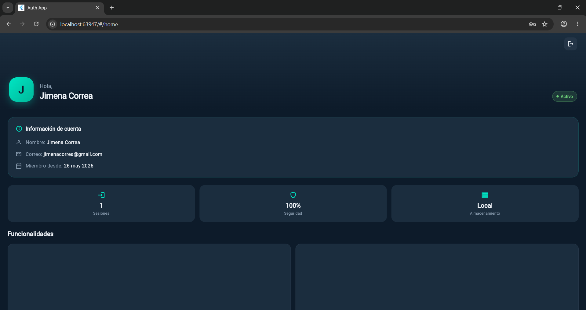
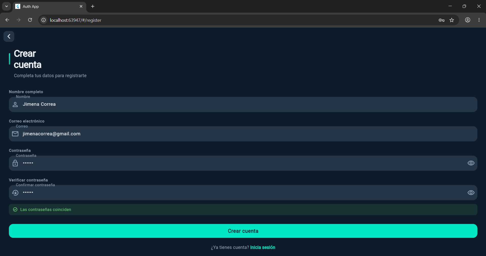

# Flutter Login App

**Nombre del estudiante:** Jimena Correa  
**Curso:** Lenguajes de programacion para moviles  
**Fecha:** 26 de mayo de 2026 

---

## Descripción

Aplicación Flutter con navegación entre pantallas, registro de usuario, inicio de sesión y pantalla principal. Los datos del usuario se guardan localmente usando `SharedPreferences`.

---

## Pantallas

### 1. Pantalla de Login
Permite al usuario ingresar su correo y contraseña para iniciar sesión. Si los datos son correctos, navega a la pantalla Home.

### 2. Pantalla de Registro
Permite crear una cuenta nueva con:
- Nombre completo
- Correo electrónico
- Contraseña
- Verificación de contraseña

Valida que las contraseñas coincidan y que tengan mínimo 6 caracteres.

### 3. Pantalla Home
Muestra un mensaje de bienvenida con el nombre del usuario registrado. Incluye un botón para cerrar sesión.

---

