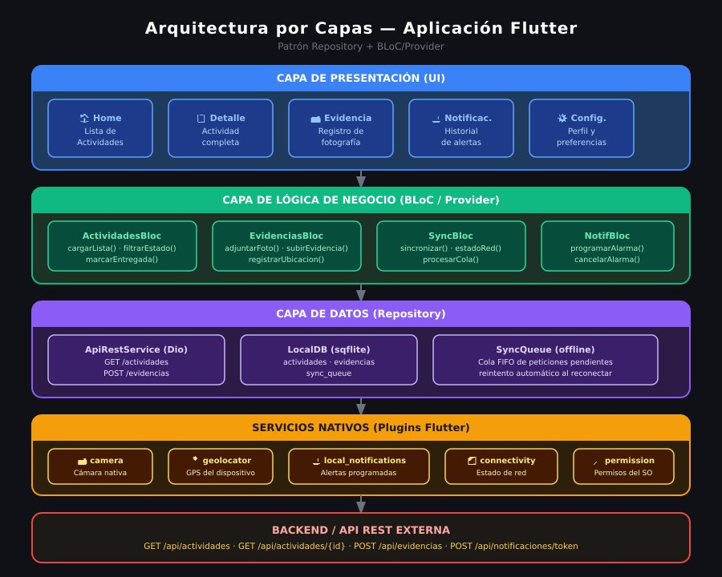
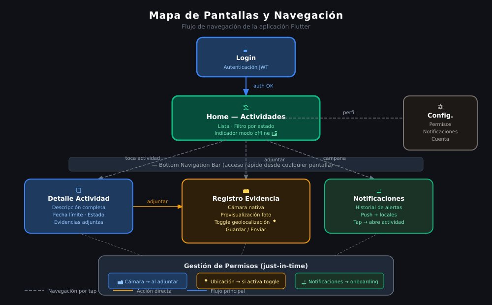
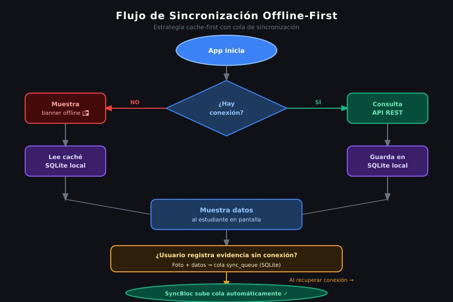

# Actividad Evaluativa – Unidad 3
## Diseño técnico de una aplicación móvil multiplataforma para un contexto real

| | |
|---|---|
| **Estudiante** | Jimena Correa Gómez |
| **Asignatura** | Lenguaje de Computación para Móviles |
| **Unidad** | Unidad 3 – Desarrollo web multiplataforma orientado a dispositivos móviles |
| **Fecha** | 2026-06-01 |
| **Modalidad** | Individual |

---

## Tabla de Contenidos

1. [Descripción del Problema](#1-descripción-del-problema)
2. [Historias de Usuario](#2-historias-de-usuario)
3. [Matriz Comparativa de Enfoques](#3-matriz-comparativa-de-enfoques)
4. [Selección Tecnológica y Justificación](#4-selección-tecnológica-y-justificación)
5. [Arquitectura Mínima Viable](#5-arquitectura-mínima-viable)
6. [Consideraciones Móviles](#6-consideraciones-móviles)
7. [Riesgos y Limitaciones](#7-riesgos-y-limitaciones)
8. [Video de Sustentación](#8-video-de-sustentación)

---

## 1. Descripción del Problema

### Contexto

Una institución educativa enfrenta dificultades en la comunicación académica con sus estudiantes. Actualmente, la información sobre actividades, tareas y anuncios se distribuye por múltiples canales no unificados (grupos de mensajería, correos, carteles físicos), lo que genera pérdida de mensajes, falta de trazabilidad y confusión entre los estudiantes.

La situación se agrava cuando los estudiantes tienen conectividad limitada o nula, ya que no pueden acceder a la información en tiempo real ni registrar evidencias de sus actividades académicas.

### Público Objetivo

- **Estudiantes** de la institución educativa, en su mayoría usuarios de dispositivos Android de gama media o baja (4 GB RAM o menos, procesadores de entrada/media gama).
- Estudiantes que pueden encontrarse en zonas con señal móvil débil o sin WiFi disponible.
- Docentes y coordinadores académicos, como generadores del contenido que la aplicación consume.

### Escenarios Principales de Uso

| Escenario | Descripción |
|-----------|-------------|
| **Sin conexión** | El estudiante abre la app sin internet y consulta las actividades y fechas que fueron sincronizadas previamente. |
| **Registro de evidencia** | El estudiante fotografía un trabajo manual o una evidencia física y la adjunta a una actividad específica. |
| **Notificación de entrega** | La app alerta al estudiante sobre actividades próximas a vencer. |
| **Consulta de actividades** | El estudiante revisa el listado de tareas pendientes, en progreso y entregadas desde una pantalla principal. |
| **Geolocalización opcional** | Al registrar una evidencia, la app puede capturar la ubicación como metadato de contexto. |

---

## 2. Historias de Usuario

Las historias están priorizadas de mayor a menor valor funcional para el estudiante.

### HU-01 – Consulta de actividades académicas *(Prioridad Alta)*
> **Como** estudiante, **quiero** consultar el listado de actividades académicas pendientes y vencidas, **para** organizar mi tiempo y no perder ninguna entrega importante.

**Criterios de aceptación:**
- La pantalla principal muestra actividades agrupadas por estado: pendiente, en progreso, entregada.
- Cada actividad muestra nombre, descripción, materia y fecha límite.
- La lista se actualiza desde la API cuando hay conexión.

---

### HU-02 – Funcionamiento sin conexión a internet *(Prioridad Alta)*
> **Como** estudiante con acceso intermitente a internet, **quiero** acceder a mis actividades aunque no tenga conexión, **para** no quedarme sin información en zonas de baja cobertura.

**Criterios de aceptación:**
- Las actividades consultadas más recientes se almacenan localmente.
- La app indica visualmente cuando está operando en modo offline.
- Al recuperar conexión, los datos se sincronizan automáticamente en segundo plano.

---

### HU-03 – Registro de evidencias fotográficas *(Prioridad Alta)*
> **Como** estudiante, **quiero** tomar una fotografía desde la app y adjuntarla a una actividad, **para** registrar la evidencia de mi trabajo de forma rápida y centralizada.

**Criterios de aceptación:**
- La app abre la cámara nativa del dispositivo al pulsar el botón "Adjuntar evidencia".
- La imagen se asocia a la actividad correspondiente.
- Si no hay conexión, la evidencia se almacena localmente y se envía al restaurar la conectividad.

---

### HU-04 – Recepción de notificaciones *(Prioridad Media)*
> **Como** estudiante, **quiero** recibir una notificación cuando una actividad está próxima a vencer, **para** no olvidar mis entregas.

**Criterios de aceptación:**
- Se envía una notificación local o push 24 horas antes del vencimiento de una actividad.
- La notificación muestra el nombre de la actividad y la fecha límite.
- El estudiante puede pulsar la notificación para acceder directamente a la actividad.

---

### HU-05 – Registro de ubicación al entregar evidencia *(Prioridad Media)*
> **Como** estudiante, **quiero** que la app registre opcionalmente mi ubicación al adjuntar una evidencia, **para** dar contexto geográfico a mi trabajo.

**Criterios de aceptación:**
- La geolocalización es opcional; el estudiante puede habilitarla o deshabilitarla.
- Si se activa, la coordenada se almacena como metadato de la evidencia.
- La app solicita el permiso de ubicación de forma explícita y explica para qué se usa.

---

### HU-06 – Visualización de detalle de actividad *(Prioridad Media)*
> **Como** estudiante, **quiero** ver el detalle completo de una actividad (descripción, instrucciones, adjuntos y estado), **para** entender qué se espera de mí sin necesidad de buscar en otros canales.

**Criterios de aceptación:**
- La pantalla de detalle muestra toda la información disponible en la API.
- Se muestran las evidencias ya registradas para esa actividad.
- La información es legible en pantallas de 5 pulgadas o menos.

---

### HU-07 – Instalación como aplicación en el dispositivo *(Prioridad Baja)*
> **Como** estudiante, **quiero** instalar la aplicación en mi teléfono como cualquier otra app, **para** acceder a ella de forma rápida desde la pantalla de inicio sin depender del navegador.

**Criterios de aceptación:**
- La app puede instalarse como APK o a través de una tienda.
- Una vez instalada, aparece como aplicación independiente con ícono propio.
- No requiere abrir el navegador para acceder.

---

## 3. Matriz Comparativa de Enfoques

Se comparan cuatro enfoques de desarrollo para el contexto específico del problema.

| Criterio | PWA | Híbrida (Ionic + Capacitor) | Nativa Android | Flutter |
|---|---|---|---|---|
| **Costo de desarrollo** | ✅ Bajo – solo web estándar | ✅ Bajo-medio – una base de código | ❌ Alto – código exclusivo Android/iOS | ✅ Bajo-medio – una base de código |
| **Reutilización de código** | ✅ 100% web reutilizable | ✅ ~95% código compartido | ❌ Cero reutilización si se requiere iOS | ✅ ~95% código compartido |
| **Acceso a cámara** | ⚠️ Limitado en Android (sin instalación) | ✅ Completo vía plugins Capacitor | ✅ Completo y nativo | ✅ Completo vía plugin camera |
| **Acceso a GPS** | ⚠️ Parcial (Geolocation API, sin permisos granulares) | ✅ Completo vía Capacitor Geolocation | ✅ Completo y nativo | ✅ Completo vía geolocator |
| **Funcionamiento offline** | ⚠️ Service Workers funcionales pero limitados en persistencia | ✅ SQLite local robusto + sincronización | ✅ Room/SQLite nativo | ✅ Hive/SQLite local robusto |
| **Rendimiento en gama media/baja** | ✅ Ligero (depende del navegador) | ⚠️ Webview puede ser lento en gama baja | ✅ Óptimo – código compilado | ✅ Excelente – compilado a ARM nativo |
| **Facilidad de mantenimiento** | ✅ Simple – stack web conocido | ✅ Bueno – web + CLI Ionic | ⚠️ Requiere conocimiento Android/Kotlin | ✅ Bueno – Dart es sencillo de aprender |
| **Publicación e instalación** | ⚠️ No aparece en Play Store fácilmente; instalación manual como PWA | ✅ APK o publicación en Play Store | ✅ APK o Play Store | ✅ APK o Play Store |
| **Limitaciones principales** | Sin acceso profundo a hardware; no instalable desde Play Store de manera directa | Depende de WebView; posible degradación en dispositivos muy viejos | Costo doble si se requiere iOS; mayor complejidad inicial | Tamaño del bundle relativamente grande (~10 MB mínimo) |
| **Decisión** | ❌ No recomendado | ✅ **Segunda opción viable** | ❌ No recomendado para este caso | ✅ **Seleccionado** |

---

## 4. Selección Tecnológica y Justificación

### Enfoque Seleccionado: Aplicación compilada a nativo con **Flutter**

### Framework / Biblioteca principal: **Flutter (Dart) + Firebase (opcional) o API REST propia**

### Justificación técnica

**Flutter** es el enfoque más adecuado para este contexto por las siguientes razones técnicas, evaluadas frente a los requerimientos específicos del caso:

#### 1. Rendimiento en dispositivos de gama media o baja
Flutter compila a código ARM nativo directamente, sin depender de un WebView como lo hace Ionic/Cordova. En dispositivos Android con 2–4 GB de RAM y procesadores de gama media (Snapdragon 4xx o MediaTek Helio G), la diferencia de fluidez es perceptible. Las animaciones corren a 60 fps sin sobrecarga adicional.

#### 2. Acceso a hardware nativo
A través del ecosistema de plugins (`camera`, `geolocator`, `flutter_local_notifications`, `sqflite`), Flutter accede a la cámara, GPS y sistema de notificaciones con permisos granulares correctamente gestionados. Esto es imprescindible para las funcionalidades HU-03, HU-04 y HU-05.

#### 3. Soporte offline robusto
El paquete `sqflite` permite almacenamiento local tipo SQLite con consultas relacionales. Combinado con un patrón de sincronización por cola (pending sync queue), la app puede operar completamente sin conexión y sincronizar cambios cuando el dispositivo vuelve a tener acceso a la red.

#### 4. Costo y tiempo de desarrollo
Flutter permite desarrollar para Android e iOS con una única base de código en Dart. Para este caso, que prioriza Android de gama media/baja, Flutter produce un APK optimizado listo para distribución directa o publicación en Play Store, sin costo adicional de adaptación por plataforma.

#### 5. Facilidad de mantenimiento y escalabilidad
Dart es un lenguaje tipado estáticamente, con una curva de aprendizaje menor que Kotlin o Swift. El patrón de arquitectura recomendado (BLoC o Provider) facilita separar la lógica de negocio de la UI, lo que simplifica las pruebas y el mantenimiento futuro.

#### 6. Por qué no los otros enfoques
- **PWA**: El acceso a la cámara desde Safari/Chrome en Android sin instalación es inconsistente. No se puede publicar en Play Store directamente, lo que dificulta la distribución institucional.
- **Nativa Android**: Viable técnicamente, pero el costo de mantenimiento se duplica si en el futuro se requiere soporte iOS. Además, requiere mayor especialización en Kotlin/Java.
- **Ionic + Capacitor**: Es una segunda opción válida, pero la dependencia del WebView implica un menor rendimiento en dispositivos de gama baja y mayor consumo de memoria.

---

## 5. Arquitectura Mínima Viable

El siguiente diagrama muestra la organización en capas del sistema, desde la interfaz de usuario hasta el backend externo:

### Pantallas principales

El siguiente mapa ilustra las pantallas de la aplicación y cómo se navega entre ellas:

| Pantalla | Descripción |
|---|---|
| **Home / Actividades** | Lista de actividades con filtro por estado. Indicador de modo offline. |
| **Detalle de Actividad** | Descripción completa, instrucciones, fecha límite, evidencias adjuntas. |
| **Registro de Evidencia** | Botón de cámara, previsualización de foto, toggle de geolocalización, botón de envío. |
| **Notificaciones** | Historial de alertas recibidas y pendientes. |
| **Configuración** | Preferencias de notificación, permisos del dispositivo, cuenta del estudiante. |

### Plugins Flutter utilizados

| Plugin | Función |
|---|---|
| `sqflite` | Base de datos SQLite local para almacenamiento offline |
| `camera` | Acceso a la cámara del dispositivo |
| `geolocator` | Obtención de coordenadas GPS |
| `flutter_local_notifications` | Notificaciones locales programadas |
| `connectivity_plus` | Detección del estado de la red |
| `dio` | Cliente HTTP para consumo de la API REST |
| `permission_handler` | Gestión de permisos del sistema (cámara, ubicación, notificaciones) |
| `provider` / `flutter_bloc` | Gestión del estado de la aplicación |

---

## 6. Consideraciones Móviles

### 6.1 Conectividad limitada

El siguiente diagrama muestra el flujo completo de sincronización offline-first implementado en la aplicación:

La app implementa una arquitectura **offline-first**: al iniciar, intenta sincronizar con la API; si no hay conexión, opera con los datos locales (SQLite). Las peticiones POST fallidas (registro de evidencias) se encolan en la tabla `sync_queue` y se reintentan automáticamente cuando `connectivity_plus` detecta que la red está disponible. Se muestra un banner no intrusivo indicando el modo offline.

### 6.2 Bajo consumo de datos
- Las imágenes de evidencia se comprimen a resolución máxima de 1080x1080px y calidad JPEG del 75% antes de subirse.
- La sincronización incremental consulta solo actividades modificadas desde la última sync (parámetro `?updated_since=`).
- No se cargan recursos pesados (videos, documentos grandes) por defecto; solo bajo demanda explícita del usuario.

### 6.3 Rendimiento en dispositivos modestos
- Flutter compila a código ARM nativo, lo que garantiza 60 fps incluso en dispositivos con procesadores de entrada.
- Se evita el uso de animaciones complejas en listas largas. Se usa `ListView.builder` para renderizado lazy (solo se renderizan los elementos visibles).
- Las imágenes en listas usan thumbnails en caché local, no la imagen original.

### 6.4 Experiencia de usuario en pantallas pequeñas
- Diseño adaptado para pantallas de 5 pulgadas o menos (resoluciones desde 720x1280).
- Tipografía mínima de 14sp para texto de cuerpo, 16sp para títulos de actividad.
- Elementos táctiles con área mínima de 48dp x 48dp según lineamientos de Material Design.
- Navegación por barra inferior (Bottom Navigation) para acceso rápido con una sola mano.

### 6.5 Permisos del dispositivo
Los permisos se solicitan en el momento en que se necesitan (just-in-time), con explicación contextual antes de mostrar el diálogo del sistema:
- **Cámara**: se solicita al pulsar "Adjuntar evidencia".
- **Ubicación**: se solicita solo si el usuario activa el toggle de geolocalización.
- **Notificaciones**: se solicita durante el onboarding inicial.

### 6.6 Seguridad básica de los datos
- Las credenciales del estudiante se almacenan en `flutter_secure_storage` (keychain/keystore nativo), no en SharedPreferences.
- Las peticiones a la API usan JWT Bearer Token en el header `Authorization`.
- Las imágenes de evidencia se almacenan en el directorio privado de la app (no accesible por otras apps sin rooting).
- No se registra ni envía la ubicación del estudiante sin su consentimiento explícito.

---

## 7. Riesgos y Limitaciones

| # | Riesgo | Impacto | Probabilidad | Estrategia de Mitigación |
|---|---|---|---|---|
| R1 | **Fallo de conexión durante el registro de evidencia** | El estudiante pierde la fotografía o no puede enviarla | Alta | Almacenar la imagen y la solicitud en `sync_queue` local; reintentar al recuperar conectividad. Mostrar confirmación visual de que se guardó localmente. |
| R2 | **Rendimiento degradado en dispositivos muy antiguos (Android 6 o inferior)** | UI lenta, cierres inesperados de la app | Media | Definir Android 8.0 (API 26) como versión mínima. Usar `ListView.builder` y evitar renders costosos. Realizar pruebas en dispositivos de referencia de gama baja. |
| R3 | **Permisos de cámara o ubicación denegados por el usuario** | El estudiante no puede registrar evidencias o geolocalización | Alta | Implementar flujo de recuperación: si el permiso es denegado, mostrar pantalla explicativa con botón para ir a Configuración del sistema. La app nunca queda bloqueada. |
| R4 | **Inconsistencia entre datos locales y API (conflictos de sincronización)** | El estudiante ve actividades desactualizadas o duplicadas | Media | Usar timestamps del servidor como fuente de verdad. La política de sincronización es "server-wins" para actividades y "local-wins" para evidencias no subidas. |
| R5 | **Tamaño del APK mayor al esperado** | Dificulta la instalación en dispositivos con almacenamiento limitado (16 GB) | Baja | Usar `flutter build apk --split-per-abi` para generar APKs separados por arquitectura (~15–20 MB por arquitectura en lugar de un APK universal de ~40 MB). |

---

## 8. Video de Sustentación

🎥 **Enlace al video:** [https://youtube.com/@jimenacorreagomez3688?si=4Qzy1QchorYB_bPG]

> El video tiene una duración máxima de 6:35 minutos y cubre los siguientes puntos:
> 1. El problema que busca resolver.
> 2. Las funcionalidades principales de la aplicación.
> 3. El enfoque tecnológico seleccionado y su justificación.
> 4. La arquitectura propuesta explicada por capas.
> 5. Decisiones técnicas clave: offline-first, rendimiento y seguridad.

---
